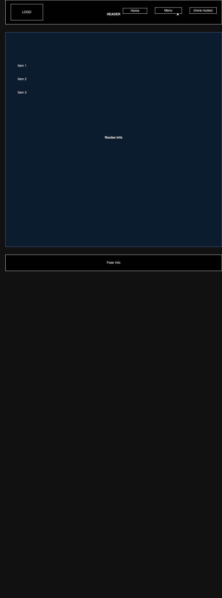

Hernan Verar:

Coffee Coxala:

Project's Purpose or Goal: 
This will be a coffee shop app that allows the users to view the menu pick items, buy or remove from a cart. tehm have diffetrent routes that allows ussers to see different pages of our app. Also have an option to login and gain points if you are recurrent client.  
  
 Languages/Framework:
 * Front-End: React, Javascript
 * Back-End: Firebase (maybe Sql)

